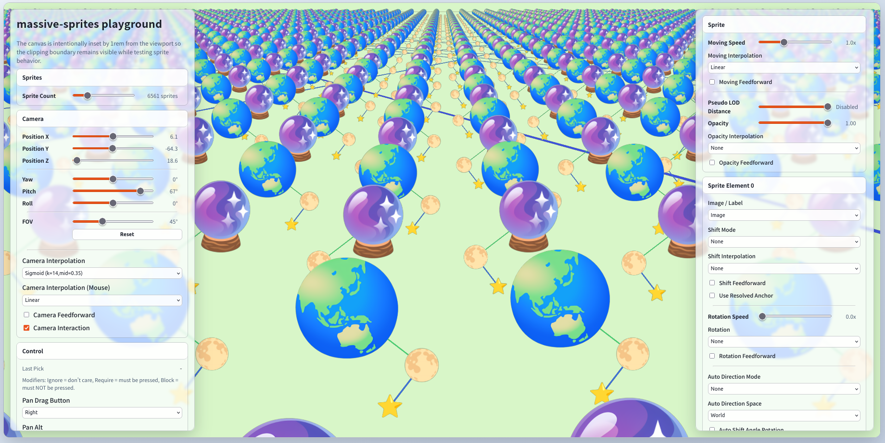
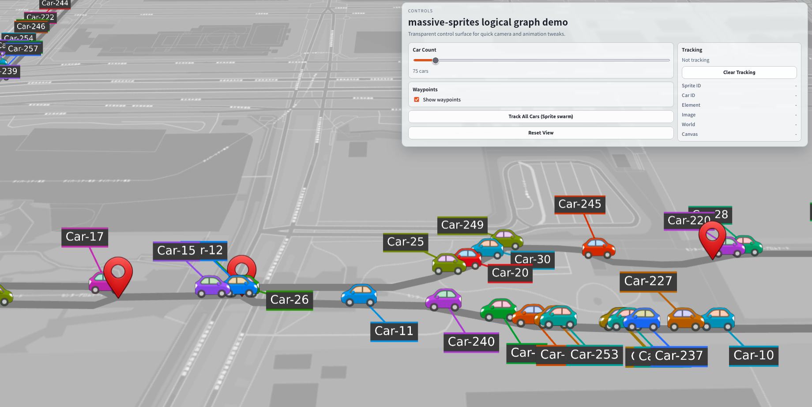

# massive-sprites

大量のスプライト、テキスト、ポリラインを高頻度に描画・移動・更新するための WebGL / WASM ライブラリ


[](https://www.repostatus.org/#wip)
[](https://opensource.org/licenses/MIT)

---

[(English language is here.)](./README.md)

## これは何？

(ドキュメントは執筆中です!)

論理座標系の上に、大量の画像やラベルを配置したい。
それらを滑らかに移動させたり、差し替えたり、フェードさせたり、ポリラインと組み合わせたりしたい。
しかも、`add / update / remove` を高頻度に繰り返しても破綻しない描画基盤が欲しい。

そんな用途のために作られているのが、 massive-sprites です。

`massive-sprites` は、任意の 2.5D 論理座標系を対象に、以下をまとめて扱えます。

- スプライト画像
- テキストラベル
- ポリライン
- レイヤー分割
- カメラとカメラの自動追跡
- 座標からオブジェクトの特定
- ほぼ全てのパラメータに、イージング補間処理を適用可能
- 距離ベースの疑似LODとスケーリング
- logical-graph APIを使った高レベル経路モデル

内部では WebGL と WASM を使っており、特に「大量の要素を継続的に更新する」ケースを意識しています。

純粋な描画・アニメーション・インタラクション処理と、描画ターゲットの実装を分離しているため、
WebGLオブジェクトを扱う別のシステムに統合する事も可能です。
標準では、HTML Canvasに描画してマウスインタラクションを行うラッパーも含まれているため、massive-spritesを既存のページに統合する事も出来ます。

logical-graph APIは、スタートポロジーを持つ論理的な経路を管理して、その上を移動する移動体を扱うことが出来る、高レベルの計算ライブラリです。
ワールド座標を扱う物理的なトポロジーをあらかじめ定義しておき、始点-終点間の位置を割合で指定し、そこにスプライトを配置して移動させることが出来ます。

路線図、構内図、トポロジビュー、搬送系、交通流、ロジカルグラフ、ゲーム寄り UI など、任意の座標空間で使えます。
以下は、HTML Canvas 上に 1 つのスプライトを配置する最小の例です:

```typescript
import {
  createObjectCanvasRenderer,
  loadWasmModule,
} from 'massive-sprites';

// 配置されているHTML Canvasを取得
const canvas = document.getElementById('main-canvas')!;

// WASMモジュールをロードしてレンダラーを生成
const wasmModule = await loadWasmModule('/assets/massive-sprites/compute.wasm');
const renderer = createObjectCanvasRenderer(canvas, wasmModule);

// レンダラーの動作を開始
renderer.start();

// 画像ファイルをURLからロードする関数
const loadBitmap = async (url: string) =>
  createImageBitmap(await (await fetch(url)).blob());

// レンダラーの初期化
await renderer.initializeScope(async () => {
  // テクスチャアトラスを生成
  const atlasId = renderer.allocateAtlas();
  // レンダリングしたい画像を登録
  const carBitmap = await loadBitmap('/assets/car.png');
  await renderer.registerImage(atlasId, 'car', carBitmap);

  // スプライトを追加するまで待機
  await renderer.addSprite(
    {
      sx: { value: 0 },  // ワールド座標系位置
      sy: { value: 0 },
      elements: [        // スプライト内の画像群
        {
          imageId: 'car',          // ロードした画像のID
          scale: { value: 0.25 },  // 画像のスケール
        },
      ],
    },
    true  // (非同期待機可能にする)
  );

  // カメラ内にスプライトが収まるように自動的にカメラを移動
  renderer.adjustCameraPosition({ interpolation: null });
});
```

デモでは、スプライト、テキスト、ポリライン、トラッキング、logical-graph を組み合わせた表現を確認出来ます:





### 主な機能

- 大量のスプライト (>10000) を配置・更新・削除出来ます。
- 各スプライトに複数の画像・テキスト・ボーダー・引き出し線を組み合わせられます。
- サーフェイス / ビルボード / パースペクティブ補正付きビルボード の描画モードを要素単位で切り替えられます。
- 移動、回転、オフセット、不透明度、スケールに対して補間を適用出来ます。
- ポリラインを独立オブジェクトとして追加出来ます。
- ピッキング、カメライベント、HTML Canvas座標変換を扱えます。
- カメラのスプライトスウォーム自動追尾と、距離ベースのスケーリング制御が出来ます。
- logical-graph APIにより、経路探索・経路描画・経路上移動を高レベルモデリング出来ます。
- WebGL と WASM により、描画を高速に実現します。

### 環境

- WebGL が利用可能なモダンブラウザ
- WASM (WebAssembly) が利用可能な実行環境

---

## インストール

ライブラリは npm パッケージとして利用出来ます:

```bash
npm install massive-sprites
```

logical-graph高レベルAPIを使う場合は、以下のようにサブパスから import します:

```typescript
import {
  createGraphGeometry,
  buildGraphPolylinePlacements,
} from 'massive-sprites/logical-graph';
```

`massive-sprites` 本体の JavaScript だけでなく、`dist/wasm/compute.wasm` も実行環境から参照出来るようにしておく必要があります。
別章の「WASMによる計算高速化」を参照して下さい。

---

## 初期化

通常は `ObjectCanvasRenderer` を使うのが簡単です。
HTML Canvas 要素、WASM モジュール、任意の初期化オプションを渡すだけで、描画ループ、ピッキング、カメラ補助 API まで扱えます。

ページに以下のようにHTML Canvasを配置しておきます:

```html
<div style="width: 100%; height: 100vh;
    margin: 0; overflow: hidden; background: #101820;">
  <canvas id="main-canvas" style="width: 100%; height: 100%; display: block;">
  </canvas>
</div>
```

`ObjectCanvasRenderer` は通常の `<canvas>` 要素をそのまま使います。
CSS で表示サイズを決めておけば良く、後段の初期化コードでは `id="main-canvas"` を取得してレンダラーへ渡します。

初期化手順を実行します:

```typescript
import {
  createObjectCanvasRenderer,
  getConsoleLogger,
  loadWasmModule,
} from 'massive-sprites';

// 配置されているHTML Canvasを取得
const canvas = document.getElementById('main-canvas');
if (!(canvas instanceof HTMLCanvasElement)) {
  throw new Error('Missing canvas element.');
}

// WASMモジュールをロードしてレンダラーを生成
const wasmModule = await loadWasmModule('/assets/massive-sprites/compute.wasm');
const renderer = createObjectCanvasRenderer(canvas, wasmModule, {
  logger: getConsoleLogger(),   // コンソールロガー
  precision: 'f32',             // 32ビット浮動小数点演算
});

// レンダラーの動作を開始
const stop = renderer.start();

// 画像ファイルをURLからロードする関数
const loadBitmap = async (url: string) =>
  createImageBitmap(await (await fetch(url)).blob());

// レンダラーの初期化
await renderer.initializeScope(async () => {
  // テクスチャアトラスを生成
  const atlasId = renderer.allocateAtlas({
    pickMask: { enabled: true, alphaThreshold: 1 },
  });

  // レンダリングしたい画像を登録
  const carBitmap = await loadBitmap('/assets/car.png');
  await renderer.registerImage(
    atlasId,
    'car',   // 画像ID
    carBitmap);

  // レンダリングしたいテキストを登録
  await renderer.registerTextGlyph(
    atlasId,
    'car-label',  // 画像ID
    'Vehicle A',  // テキスト
    { maxWidthPixel: 192 },
    {
      color: '#ffffff',
      backgroundColor: 'rgba(0, 0, 0, 0.7)',
      paddingPixel: { top: 6, right: 10, bottom: 6, left: 10 },
      borderColor: 'rgba(255, 255, 255, 0.35)',
      borderWidthPixel: 1,
      borderRadiusPixel: 8,
    }
  );

  // スプライトを追加
  const spriteId = await renderer.addSprite(
    {
      sx: { value: 0 },  // ワールド座標系
      sy: { value: 0 },
      elements: [  // このスプライト内の画像やテキスト（最大8エントリ）
        {
          imageId: 'car',                 // 画像ID
          mode: 'billboard_perspective',  // 描画モード
          scale: { value: 0.25 },         // スケール
        },
        {
          imageId: 'car-label',   // 画像ID
          mode: 'billboard',      // 描画モード
          originLocation: { index: 0, useResolvedAnchor: true },  // 親エレメント参照
          shiftDistance: { value: 42 },  // シフト距離
          shiftAngleDeg: { value: 90 },  // シフト角度
          scale: { value: 0.18 },        // スケール
        },
      ],
    },
    true  // (非同期待機可能にする)
  );

  // カメラを自動トラッキングさせる
  renderer.setCameraTracking({
    spriteIds: [spriteId],  // 対象のスプライト
    minDistance: 120,       // 最小距離（最接近距離）
  });

  // カメラ内にスプライトが収まるように自動的にカメラを移動
  renderer.adjustCameraPosition({ interpolation: null });
});

// 停止させる場合
// stop();
// renderer.release();
```

`addSprite(..., true)` や `updateSprite(..., true)` のようなAPIは、 `Promise<T>` を返却するオーバーロード (`awaitable = true`) を定義しています。
これらのAPIは、要求がmassive-spritesに認識されるまでに待機時間を必要とするものがあります(計算処理が実行されるまで待機が必要です)。

要求が確実に認識されるまで待機させたい場合は、 `Promise<T>` を `await` で待機して下さい。
待機せず、Fire-and-forgetさせる場合は、 `awaitable = false` とすることで、余分なリソースを削減出来ます。
待機しない場合は、結果値を取得できないことに注意して下さい。

`initializeScope()` は重要です。
初期化時などの、レンダリング開始前またはレンダリングポンプ外で安全に非同期待機を行いたい場合は、このスコープ内で処理することで計算を進行させ、安全に `Promise<T>` を待機出来ます。

低レベルな制御が必要な場合は `createObjectRenderer()` も使用出来ます。
こちらは WebGL コンテキストや描画タイミングを自分で管理したいケース向けです。

---

## テクスチャアトラスの準備と画像・テキストの登録

massive-spritesでは、テキストの描画も画像として扱います。
画像やテキストは直接スプライトに貼るのではなく、まずテクスチャアトラスに登録して参照出来るようにします。

テクスチャアトラスとは、多くの画像を一枚の大きなテクスチャに配置する機能です。
テクスチャアトラス内の画像は、非常に短時間にレンダリング処理が可能になるため、用途が近しい画像を同じアトラスに登録することで、効率よくレンダリング出来るようになります。
デメリットとして、テクスチャアトラス内の画像整理にはコストがかかるため、頻繁に登録・削除する画像は、別のアトラスを確保して登録する事をお勧めします。

アトラスは `allocateAtlas()` で確保し、`registerImage()` / `registerTextGlyph()` で内容を追加します。

```typescript
// テクスチャアトラスを生成する
const atlasId = renderer.allocateAtlas({
  widthPixel: 2048,    // アトラス全体の幅と高さ
  heightPixel: 2048,
  paddingPixel: 2,     // 画像を並べる場合に空けるピクセル数
  textureSampling: {   // テクスチャサンプリングオプション
    minFilter: 'linearMipmapLinear',
    magFilter: 'linear',
    maxAnisotropy: 4,
  },
  pickMask: { enabled: true, alphaThreshold: 1 },  // ピッキングマスクオプション
});

// 指定されたアトラスに画像を登録する
await renderer.registerImage(
  atlasId,    // アトラスID
  'car',      // 画像ID
  carBitmap,  // 画像データ
  false,      // POT最適化
  {
    resize: {   // 画像リサイズパラメータ
      maxWidth: 512,
      maxHeight: 512,
      mode: 'contain',
      quality: 'high',
    },
    logicalSize: { widthPixel: 256, heightPixel: 256 },  // 論理サイズ
  });

// 指定されたアトラスにテキスト文字列を登録する
await renderer.registerTextGlyph(
  atlasId,      // アトラスID
  'label',      // テキストID (画像IDとして扱う)
  'Station A',  // テキスト文字列
  { maxWidthPixel: 180 },  // 最大幅、または最大行高さ
  {
    color: '#ffffff',    // 各種テキスト描画パラメータ
    backgroundColor: 'rgba(0, 0, 0, 0.65)',
    paddingPixel: { top: 6, right: 10, bottom: 6, left: 10 },
    borderColor: 'rgba(255, 255, 255, 0.35)',
    borderWidthPixel: 1,
    borderRadiusPixel: 8,
  }
);
```

画像とテキストは、どちらも `imageId` (画像ID) で参照されます。
つまり、テキストグリフも「画像の一種」として扱われます。

アトラス登録まわりの主なポイントは以下の通りです:

- `registerImage()` は `TexImageSource` を受け取る。
- `registerTextGlyph()` は文字列からグリフ画像を生成してアトラスへ登録する。
- `logicalSize` を使うと、元画像のピクセルサイズと、レイアウト上の見かけサイズを分離できる。
- `resize` を使うと、アップロード前に画像サイズを調整できる。
- `pickMask` を有効にすると、透明ピクセルを考慮したスプライトピッキングができる。
- 不要になった画像は `unregisterImage()` で外せる。
- アトラスごと破棄したい場合は `releaseAtlas()` を使う。

テキストサイズの指定方法は 2 通りあります:

- `maxWidthPixel`: 指定幅に収まるように文字サイズを自動調整する。
- `lineHeightPixel`: 1 行の高さを基準に文字サイズを決める。

### テクスチャアトラスオプション

`allocateAtlas()` では以下を調整出来ます:

- `widthPixel`
- `heightPixel`
- `paddingPixel`
- `uvInsetPixel`
- `maxPages`
- `defaultImageResize`
- `textureSampling`
- `pickMask`

以下のパラメータは特に重要です:

- `pickMask`: 透明ピクセルを考慮したピッキング判定を実現します。追加マスクデータが必要になるため、オプション扱いです。
- `paddingPixel`: 画像間の余白です。フィルタブリード対策に使用します。
- `uvInsetPixel`: サンプリング境界の滲みを抑えます。
- `textureSampling`: mipmap や anisotropy を含むサンプリングパラメータを指定します。

`pickMask` が無効の場合（デフォルト）、スプライトのピッキングはエレメントの矩形領域を基準に行われます。
そのため、画像の周囲に透明余白があっても、その余白を含む矩形全体がヒット対象になります。

`pickMask` を有効にすると、アトラスへ画像を登録する時点で alpha 値から 1 ビットのマスクが生成され、`pickAt()` や `onPick()` の判定で透明ピクセルを除外できます。
`alphaThreshold` は `0..255` の値で、これ未満の alpha 値を持つピクセルを透明扱いにします。

```typescript
// 透明ピクセルを考慮したピッキングを有効にする（アトラス単位）
const atlasId = renderer.allocateAtlas({
  pickMask: {
    enabled: true,
    alphaThreshold: 8,
  },
});

// アトラスに画像を登録
await renderer.registerImage(
  atlasId,
  'pin',
  await loadBitmap('/assets/pin.png')
);

// pickMask を有効にしておくと、透明部分はヒット対象から外れる
const pickResult = renderer.pickAt(320, 240);
if (pickResult?.kind === 'sprite') {
  console.log('sprite hit', pickResult.spriteId, pickResult.elementIndex);
}
```

ピン画像や人物シルエットのように、矩形全体ではなく可視部分だけを正確に拾いたい場合に有効です。

`paddingPixel`、`uvInsetPixel`、`textureSampling` は、描画品質とアトラス効率のバランスを取るためのパラメータです。
特に、縮小表示や mipmap を使うケースでは見た目に直結します。

|項目|役割|調整の目安|
|:---|:---|:---|
|`paddingPixel`|アトラス内で画像同士の間に空ける余白です。隣接画像の色がにじむのを防ぎます。|`linear` 系フィルタや mipmap を使うなら 1〜4 ピクセル程度あると安定します。|
|`uvInsetPixel`|サンプリング時に画像境界から少し内側を参照するための inset 値です。|境界ブリードが見える場合に増やします。通常は `paddingPixel` 以下に保ちます。|
|`textureSampling`|拡大・縮小時のフィルタ、wrap、anisotropy を指定します。|画質優先なら `linear` / mipmap / anisotropy、有効メモリや速度優先なら `nearest` 寄りを選びます。|

例えば、ラベルやアイコンを縮小表示しつつ滑らかに見せたい場合は、次のような設定が使えます:

```typescript
// ラベルやアイコンを格納するアトラスを生成する
const atlasId = renderer.allocateAtlas({
  widthPixel: 2048,
  heightPixel: 2048,
  paddingPixel: 4,   // 画像間の余白を十分に確保する
  uvInsetPixel: 1,   // 境界サンプリングを少し内側へ寄せる
  textureSampling: {
    minFilter: 'linearMipmapLinear',  // 縮小時は mipmap を使う
    magFilter: 'linear',              // 拡大時は線形補間する
    wrapS: 'clampToEdge',             // 通常のアトラスでは端で折り返さない
    wrapT: 'clampToEdge',
    npotPolicy: 'fallback',           // WebGL1 で NPOT 制約がある場合は安全側へ倒す
    maxAnisotropy: 4,                 // 斜め視点でのにじみを抑える
  },
});
```

逆に、ドット絵やピクセル完全一致を優先したい場合は、`textureSampling.minFilter` / `magFilter` を `nearest` に寄せる方が意図した見た目になります。

---

## スプライトとスプライトエレメント群

1 つのスプライトは、基準座標と、その配下にぶら下がるスプライトエレメント配列から構成されます。

- スプライトエレメントは、スプライト当たり最大8個まで配置出来ます。
- スプライトは `sx` / `sy` / `sz` を持つ。値の単位はワールド座標であり、特定の単位を持ちません。
  注意: 現在は `sz` の指定は機能しません。これが 2.5D 表現の理由です。
- 各スプライトエレメントは `imageId`、描画モード、スケール、回転、アンカー、オフセット、ボーダー、引き出し線などを持てます。
- 1 つのスプライトに複数のスプライトエレメントを持たせることで、アイコン本体、ラベル、警告マーク、補助線などを一体で管理出来ます。

```typescript
// スプライトを登録する
const spriteId = await renderer.addSprite(
  {
    sx: { value: 120 },     // ワールド座標
    sy: { value: 80 },
    opacity: { value: 1 },  // 不透明度 (0.0〜1.0)
    elements: [  // スプライト内のエレメント群の定義
      {
        imageId: 'car',          // 画像ID
        mode: 'surface',         // 描画モード
        scale: { value: 0.22 },  // スケール
      },
      {
        imageId: 'label',        // 画像ID (テキストID)
        mode: 'billboard',       // 描画モード
        originLocation: { index: 0, useResolvedAnchor: true },
        shiftDistance: { value: 36 },
        shiftAngleDeg: { value: 90 },
        scale: { value: 0.18 },  // スケール
      },
    ],
  },
  true
);
```

## 配置と更新のセマンティクス

初期配置では `ObjectPlacementValue<T>`、更新では `ObjectUpdateValue<T>` を使います。
どちらも値本体に加えて、補間情報を一緒に持てます。

```typescript
// スプライトを更新する
await renderer.updateSprite(
  spriteId,  // スプライトID
  {
    sx: {                  // sxの更新
      value: 480,          // 新しい位置
      interpolation: {     // 新しい補間係数
        mode: 'feedback',
        durationMs: 800,
        easing: { type: 'cubic', mode: 'in-out' },
      },
    },
    elements: [
      undefined,   // スプライトエレメント0番は無変更 (undefined)
      {
        opacity: {           // スプライトエレメント1番の不透明度
          value: 0.4,        // 新しい不透明度
          interpolation: {   // 新しい補間係数
            mode: 'feedback',
            durationMs: 400,
            easing: { type: 'linear' },
          },
        },
      },
      null,
    ],
  },
  true
);
```

特に重要なルールは以下の通りです:

- `SpriteUpdate.elements[index] === undefined`: その要素は変更しない。
- `SpriteUpdate.elements[index] === null`: その要素を削除する。削除後は配列が詰められる。
- `SpriteUpdate.elements[index] === object`: 既存要素を更新、または末尾なら追加。
- `imageId === undefined`: 現在の画像を維持する。
- `imageId === null`: 現在の画像バインドを解除する。
- `visibilityDistance === undefined`: 現在値を維持する。
- `visibilityDistance === null`: 疑似 LOD を無効化する。

スプライト ID は安定した公開 ID であり、他のスプライトを削除しても変わりません。
一方で、要素インデックスは compaction の影響を受けるため、要素削除後は `originLocation.index` の再計算を呼び出し側で行う必要があります。

注意: `SpriteUpdate.elements[]` は最大8要素です。また、要素インデックスの仕様は将来的に変更される可能性があります。

## レイヤーと描画順

スプライトやポリラインは、レイヤーIDによって大きく描画順が決定されます。
また、スプライトエレメント同士はオーダー値によっても描画順が決定されます。


レイヤーIDは0〜31までの値を取ります。オーダーは0〜7ですが、スプライト内で重複していても構いません。

```typescript
// スプライトを登録する
const spriteId = await renderer.addSprite(
  {
    sx: { value: 120 },
    sy: { value: 80 },
    elements: [  // スプライト内のエレメント群の定義
      {
        imageId: 'car',
        mode: 'surface',
        layer: 0,            // レイヤーID
        order: 0,            // オーダー
      },
      {
        imageId: 'label',
        mode: 'billboard',
        layer: 0,            // レイヤーID
        order: 1,            // オーダー
      },
    ],
  },
  true
);
```

スプライトエレメントの描画順序は、以下の順で評価されます:

1. `layer`: 同じシーン内の大枠の前後関係です。大きい値ほど手前に描かれます。スプライト要素とポリラインの両方で使え、相互に考慮されます。タイブレークの場合は2にフォールバックします。
2. `order`: スプライト内の要素同士の重なり調整です。大きい値ほど手前に描かれます。タイブレークの場合は3にフォールバックします。
3. カメラとの距離: 最終的にカメラとの距離で判定します。

`layer` は大局的な整理、`order` は同一スプライト内の微調整、と考えると分かりやすいでしょう。

上記の1〜3の評価結果が全てタイブレーク状態の場合は、レンダリングが安定しない（表示がチラつく）場合があります。
その場合は、レイヤーとオーダーを見直して、明確に順序が分離されるようにして下さい。
特に3の計算は、計算誤差によって前後が入れ替わる可能性があります。

## 描画モード

スプライトエレメントの描画モードは以下の 3 種類です:

- `surface`: サーフェイスモード。ワールド平面に貼り付きます。床面や地平面に沿わせたい要素に使用します。
- `billboard`: ビルボードモード。常にカメラへ正対します。HUD 的なラベルやアイコンに使用します。
- `billboard_perspective`: パースペクティブ補正付きビルボードモード。カメラ正対を保ちながら遠近感を表現します。正対した画像に、位置による角度補正を適用します。


`surface` は、平面にステッカーのようにスプライトが張り付くレンダリングが行われます。

それに対して `billboard` はカメラに常に正対します。
カメラの平面に対する角度に関わらず、常に正対して表示されるため、視認性が上がります。
一般的に、ヘッドアップディスプレイ (HUD) の識別用アイコンを描画するために使用されます。

`surface` の場合には正しい方向を向いていたのに、 `billboard` にすると方向が正しくない場合は、 `billboard_perspective` を使用する事が出来ます。
例えば、画像が矢印を含んでいて方向を表現する場合、現在のカメラ視野を考慮して自動的に画像が回転するため、矢印がそれらしい方向を向きつつ、 `billboard` のように正対しているので視認性も高くなります。

## アンカーと基準点

アンカーとは、スプライトエレメントが参照する「座標基準点」の位置を定めるものです。


各エレメントの `anchorX` / `anchorY` は、エレメント内部の基準点を表します。
値はエレメントの半幅・半高さに対する相対値として使われるため、通常は `-1.0` から `1.0` 前後で扱います。
`0.0` は中心です。

```typescript
// エレメント群の定義
elements: [
  {   // エレメント (index=0)
    imageId: 'pin',
    anchorX: { value: 0.0 },       // アンカー位置指定（下辺中央）
    anchorY: { value: 1.0 },
    originLocation: { index: 2 },  // 別のエレメント(index=2)の基準座標を参照
  }
];
```

また、`originLocation` を使うと、別のエレメントを親エレメントとして相対配置出来ます。
例えば、アイコンにラベルを表示し、かつ自動的に追従させたい場合などに便利です。
詳しくは次節を参照して下さい。

## シフト

スプライトの基準点からずらしてエレメントを表示したい場合は、シフト機能を使用します。
シフト機能は極座標パラメータを指定して、位置をずらします。


ラベルをアイコンの上側に逃がしたり、複数要素を放射状に配置したりする場合に使います。

`shiftDistance` と `shiftAngleDeg` は、要素を基準点から極座標的にずらすためのパラメータです。

```typescript
// エレメント群の定義
elements: [
  {  // 親エレメント (index=0)
    imageId: 'pin',
    //  :
    //  :
  },
  {   // 子エレメント (index=1)
    imageId: 'label',
    mode: 'billboard',
    originLocation: { index: 0, useResolvedAnchor: true },  // 親を参照（アンカーも解決）
    shiftDistance: { value: 32 },  // 親の基準座標点からの距離
    shiftAngleDeg: { value: 90 },  // 親の基準座標点からの角度
  },
];
```

- `shiftDistance`: ワールド単位の距離。基準座標からどれだけ移動するかを示します。
- `shiftAngleDeg`: `shiftDistance` で移動した距離を半径として、時計回りに回転させる度数単位の角度です。

`originLocation` と組み合わせると、基準座標点を親と連携させることが出来るので、
子孫を連携させる階層的な UI のような構成も作れます。

上記の例では、 `useResolvedAnchor` が `true` なので、親エレメントのアンカー解決後の位置を基準座標とします。
また、親エレメントの描画モードによって、極座標の回転平面が変化します。

|親エレメントの描画モード|極座標の回転平面|
|:---|:---|
|`surface`|親エレメントが基準とする平面（並行平面）上で、極座標を回転させます。|
|`billboard`,`billboard_perspective`|親エレメントが基準とする平面（カメラ正対平面）上で、極座標を回転させます。|

並行平面はz=0とは限らないことに注意して下さい。親子孫とエレメント参照で描画モードを複雑に変更する場合は、平面が浮いたり沈んだりする可能性が有ります。
通常は、親子関係のエレメントで描画モード全て統一しておくと良いでしょう。

## 回転

エレメント画像を回転させることも出来ます。


回転角は `rotation` で指定します。時計回りに回転させる度数単位の角度です。

```typescript
// 回転付きスプライトを追加する
const spriteId = await renderer.addSprite(
  {
    sx: { value: 120 },
    sy: { value: 80 },
    elements: [
      {
        imageId: 'arrow',
        mode: 'billboard',
        anchorX: { value: 0.5 },  // 画像中央からずれた位置を回転中心にする
        anchorY: { value: 0.5 },
        rotation: { value: 45 },  // 時計回りに45度回転
      },
    ],
  },
  true
);

// 後から回転角を変更する
await renderer.updateSprite(
  spriteId,
  {
    elements: [
      {
        rotation: { value: 135 },
      },
    ],
  },
  true
);
```

回転の中心はアンカーで変わります。
したがって、「中心で回す」「先端で回す」をアンカー設定だけで切り替えられます。

## 拡大率

テクスチャアトラスに登録されている画像に対して、拡大率を指定出来ます。


要素の `scale` は、登録画像またはテキストの論理サイズに対する倍率です。
画像自体のピクセルサイズとは独立して扱えるので、以下のように分離出来ます。

- 元画像は大きめに用意する
- アトラス登録時に `logicalSize` でレイアウト上のサイズを指定する
- シーン中では `scale` で個別に倍率調整する

同じ画像 ID を使い回しながら、スプライトごとに異なる見かけサイズを持たせるのに向いています。

なお、拡大率の中心もアンカーで変わります。

## 不透明度と表示制御

不透明度は、スプライト全体とスプライトエレメント個別の両方で持てます。
描画時には、それらが乗算され、最終的な不透明度で判定されます。

- スプライトの `opacity`: スプライト全体に効く
- スプライトエレメントの `opacity`: 特定エレメントだけに効く

そのため、アイコン本体は表示したままラベルだけ薄くする、といった制御が行えます。
また、補間と組み合わせればフェードイン・フェードアウトもそのまま表現出来ます。


以下に不透明度の例を示します:

```typescript
const spriteId = await renderer.addSprite(
  {
    sx: { value: 120 },
    sy: { value: 80 },
    opacity: { value: 1.0 },  // スプライト全体の基礎不透明度
    elements: [
      {
        imageId: 'car',
        opacity: { value: 1.0 },  // 本体アイコンは完全表示
      },
      {
        imageId: 'label',
        mode: 'billboard',
        originLocation: { index: 0, useResolvedAnchor: true },
        shiftDistance: { value: 36 },
        shiftAngleDeg: { value: 90 },
        opacity: { value: 0.8 },  // ラベルだけ少し薄くする
      },
    ],
  },
  true
);

// スプライト全体を少し暗くしつつ、ラベルだけフェードアウトする
await renderer.updateSprite(
  spriteId,
  {
    opacity: {
      value: 0.6,
      interpolation: {
        mode: 'feedback',
        durationMs: 300,
        easing: { type: 'linear' },
      },
    },
    elements: [
      undefined,  // エレメント 0 は変更しない
      {
        opacity: {
          value: 0.0,
          interpolation: {
            mode: 'feedback',
            durationMs: 500,
            easing: { type: 'sine', mode: 'out' },
          },
        },
      },
    ],
  },
  true
);
```

この例では、最終的なラベルの見え方は「スプライト全体の `opacity`」と「ラベル要素自身の `opacity`」の乗算で決まります。
したがって、スプライト全体を薄くしつつ、特定のエレメントだけ完全に消す、といった制御を自然に記述できます。

`opacity` の評価値が 0.0 となるエレメントは、レンダリング対象から除外されるため、効率よく処理されます。

## スプライト/ポリラインスケーリングと疑似LOD

スプライト/ポリラインスケーリングと疑似LODは、距離に応じた見え方を調整します。
主に、視認性を向上させる目的で使用します。

スプライト/ポリラインスケーリングは、遠景ではラベルや装飾を読めるように縮小制限したり、近景では過剰な拡大を制限する、といった調整に使えます。
疑似LODは、カメラから基準点までの距離が閾値を超えると、描画不透明度が0となり、表示から除外されます。


以下にこれらを指定する例を示します:

```typescript
// レンダラーを生成する際のオプションとして指定する
const renderer = createObjectCanvasRenderer(canvas, wasmModule, {
  spriteScaling: {     // スプライトスケーリング（ワールド座標距離）
    minScaleDistance: 40,
    maxScaleDistance: 400,
  },
  polylineScaling: {   // ポリラインスケーリング（ワールド座標距離）
    minScaleDistance: 40,
    maxScaleDistance: 800,
  },
});

//   :
//   :

// スプライトを追加する
await renderer.addSprite(
  {
    sx: { value: 0 },
    sy: { value: 0 },
    visibilityDistance: 600,   // 疑似LOD距離（ワールド座標距離）
    elements: [{ imageId: 'car' }],
  },
  true
);
```

- `spriteScaling` / `polylineScaling`: レンダラー生成時にのみ指定できるオプションです。距離に対する見かけサイズの増減をクランプします。
- `visibilityDistance`: スプライト単位の疑似 LOD です。

疑似LODは、不透明度を制御しますが、これは前節までに説明した各不透明度の計算結果に、更に疑似LODの結果によって1.0または0.0を乗算することで、最終的な不透明度を算出します。
補間パラメータはこの値に対して適用されるので、疑似LODによって制御される可視性も補間させることが出来ます。

## 自動方位制御

スプライトエレメントは、移動方向に応じて向きを自動的に変えられます。これが `autoDirection` です。
以下の利用シーンが考えられます:

- 車両アイコンを進行方向へ向ける
- 人物アイコンを進行方向に合わせて左右反転する
- 子エレメントのシフト回転も進行方向に追従させる


以下に自動方位制御の例を示します:

```typescript
// スプライトエレメント定義
{
  imageId: 'car',
  autoDirection: {     // 自動方位制御
    space: 'world',    // 基準座標系をワールド座標とする
    mode: { type: 'rotation' },  // 制御モード
    shiftAngleRotation: true,    // シフト回転を行うかどうか
    minDistance: 1,    // 回転検出距離
  },
}
```

基準座標系 `space` は、 `world` または `parent_local` から選択します:

|`space`|方向判定に使う座標系|向いている用途|
|:---|:---|:---|
|`world`|スプライト基準座標の移動量を、そのままワールド座標系で判定します。|路線図やマップ上で、車両や人物の進行方向をワールド上の移動に合わせたい場合。|
|`parent_local`|親エレメントが基準とするローカル平面で移動量を判定します。|`originLocation` を使った子エレメントで、親の回転やビルボードを踏まえて向きを制御したい場合。|

`world` はワールド全体から見れば自然な位置が計算されますが、 `originLocation` で複数のエレメントが連結されている場合は、多重振り子の端点のように、エレメントが激しく振られる場合が有ります。
`parent_local` であれば、親エレメントだけを参照して位置が決定されるため、安定的に見えます。

制御モード `mode` は以下のどちらかを選択出来ます（排他選択です）:

|`type`|効果|主な追加パラメータ|
|:---|:---|:---|
|`rotation`|自動回転を行います。進行方向を向くようにエレメントを回転させます。`rotation.value` とは独立しており、加算されます。|なし|
|`flipping`|自動フリップを行います。進行方向に応じてローカル軸を反転させます。2D 的な反転表現に向いています。|`flipX?: boolean`、`flipY?: boolean`、`interpolation?: ObjectInterpolationParameter`|

自動回転の場合は、補間パラメータはエレメント回転に指定した補間パラメータが使用されます。
自動フリップの方は、より模式図に向いた表現と言えます。一般的には左右のフリッピングのみ有効化 (`flipX: true`) すれが良いと思われますが、上下のフリッピングも可能です。
また、フリッピング専用に使用される補間パラメータを指定することも出来ます。

注意: フリッピングは、正または逆の状態に応じて、1.0または-1.0を軸に乗算するように計算されるため、フリップの途中の値を明示的に指定して止めることは出来ません。
つまり、補間パラメータを指定しないで使用した場合は、瞬時にフリップが行われます。

## ボーダーと引き出し線

スプライトエレメントにはボーダーと引き出し線を表示出来ます。

エレメント引き出し線は、親エレメントと線で接続して、関係を持たせたい時に使用します。
テキストラベルと接続すれば、吹き出しのように使えます。
引き出し線は親子エレメント間に引かれるので、基準座標により一緒に移動します。スプライトに自動追尾するラベルとして機能します。


以下にボーダーと引き出し線の例を示します:

```typescript
// スプライトエレメントのパラメータ
{
  imageId: 'label',
  mode: 'billboard',
  border: {                 // エレメントにボーダーを表示
    color: '#ffffff',     // ボーダー色
    width: 2,               // ボーダー幅（ワールド座標）
  },
  originLocation: { index: 0 },  // 親エレメントを参照
  leaderline: {                  // 親エレメントの基準座標点間に引き出し線を表示
    width: { value: 3 },    // 引き出し線幅（ワールド座標）
    color: {                // 引き出し線色（グラデーション）
      color0: '#ffffff',
      color1: '#7dd3fc',
      repeatLength: 80,
    },
  },
}
```

エレメントのボーダーとテキストの枠線は似ていますが、異なる目的で設計されています:

- エレメントボーダー: 画像そのものの外形を強調したい時。エレメント選択表現や範囲の可視化などに使用
- テキスト枠線や背景: テキストラベルに装飾を加えて可読性を上げたい時に使用

また、エレメントボーダーは太さや色を動的に変更出来ます。
しかし、テキストの枠線はテクスチャに焼き込み（ベーク）されるため、変更できません。

注意: ボーダーはinsetです。つまり、スプライトエレメントが占める領域の内側に伸びます。

## スプライト移動補間

`sx` / `sy` の更新に対して補間を指定すると、スプライトの移動を滑らかに出来ます。
移動補間には、新しい値（座標）、補間モード、補間を行う期間、補間に使用するイージング関数とそのパラメータを指定します。

```typescript
// スプライトを更新して補間を設定する
await renderer.updateSprite(
  spriteId,
  {
    sx: {                   // sxの移動に補間を適用
      value: 320,           // 新しい座標
      interpolation: {      // 新しい補間パラメータ
        mode: 'feedback',   // 補間モード
        durationMs: 1200,   // 補間期間 (msec)
        easing: { type: 'sine', mode: 'in-out' },
      },
    },
    sy: {                   // syの移動に補間を適用
      value: 180,           // 新しい座標
      interpolation: {      // 新しい補間パラメータ
        mode: 'feedback',   // 補間モード
        durationMs: 1200,   // 補間期間 (msec)
        easing: { type: 'sine', mode: 'in-out' },
      },
    },
  },
  true
);
```

`durationMs` は、補間パラメータの効果をこの期間で完了させる間隔です。
`mode` は補間モードで、 `feedback` と `feedforward` を指定出来ます:

|`mode`|効果|
|:---|:---|
|`feedback`|古い座標から新しい座標に向かって、指定された補間時間をかけて移動する。|
|`feedforward`|古い座標から新しい座標に向かって、指定された補間時間をかけて移動したと仮定し、そのベクトルを補間時間だけ延長した座標を移動予測座標とし、新しい座標から移動予測座標に向かって、指定された補間時間をかけて移動する。|

頻繁な目標値更新に対する追従感をどうしたいかで使い分けて下さい。
`feedback` は、指定された通りに補間動作を行いますが、座標位置が完了までの時間だけ遅れることになります。
`feedforward` を使用すると、（直線ですが）移動先を予測して動作するため、リアルタイム追従性が向上します。但し、実際の直線性が崩れると、オーバーシュートのような動作が発生します。

`easing` は、補間期間中に「イージング関数」を用いた曲線で補間動作を行わせるためのパラメータです。
詳細は次節を参照して下さい。

## イージング関数

補間で使用できるイージング関数は以下の通りです:

|種別|主な用途|追加パラメータ|`mode`|
|:---|:---|:---|:---|
|`linear`|一定速度で直線的に補間したい場合に使います。|なし|なし|
|`ease`|一般的な ease-in / ease-out 系の滑らかな加減速を作りたい場合に使います。|`power?: number`<br>カーブの強さを調整します。大きいほど立ち上がりや収束が強くなります。|`'in' \| 'out' \| 'in-out'`|
|`sigmoid`|中央付近を滑らかにしつつ、前後をなだらかに抑えたい場合に使います。|`k?: number`<br>立ち上がりの急峻さです。<br>`mid?: number`<br>変化の中心位置です。|なし|
|`exponential`|開始直後または終了直前の変化量を強くしたい場合に使います。|`exponent?: number`<br>指数カーブの強さを調整します。|`'in' \| 'out' \| 'in-out'`|
|`quadratic`|軽めの加減速を付けたい場合に使います。|なし|`'in' \| 'out' \| 'in-out'`|
|`cubic`|`quadratic` より強い加減速を付けたい場合に使います。|なし|`'in' \| 'out' \| 'in-out'`|
|`sine`|自然で柔らかい加減速を付けたい場合に使います。|`amplitude?: number`<br>サインカーブの振れ幅を調整します。|`'in' \| 'out' \| 'in-out'`|
|`bounce`|着地や接触のような跳ね返り表現を付けたい場合に使います。|`bounces?: number`<br>跳ねる回数です。<br>`decay?: number`<br>各バウンドで減衰する量です。|なし|
|`back`|目標値へ向かう前に少し引いてから進む、あるいは行き過ぎて戻る演出に使います。|`overshoot?: number`<br>はみ出し量を調整します。|なし|

`mode` は、加速寄りの `'in'`、減速寄りの `'out'`、その両方を組み合わせた `'in-out'` を表します。
例えば、フェードインなら `'out'` より `'in'`、停止動作なら `'in'` より `'out'` の方が自然に見えることがあります。

## シフト・スケール・回転・不透明度・アンカーの補間

補間は座標点だけでなく、要素の `shiftDistance`、`shiftAngleDeg`、`scale`、`rotation`、`opacity`、`anchorX`、`anchorY` にも適用出来ます。

```typescript
// スプライトを更新して補間を設定する
await renderer.updateSprite(
  spriteId,
  {
    elements: [   // スプライトエレメント
      {
        rotation: {          // 回転角
          value: 90,         // 新しい回転角
          interpolation: {   // 補間パラメータ
            mode: 'feedback',
            durationMs: 500,
            easing: { type: 'back', overshoot: 1.4 },
          },
        },
        shiftDistance: {     // シフト距離
          value: 52,         // 新しいシフト距離
          interpolation: {   // 補間パラメータ
            mode: 'feedback',
            durationMs: 500,
            easing: { type: 'quadratic', mode: 'out' },
          },
        },
        opacity: {           // 不透明度
          value: 0.2,        // 新しい不透明度
          interpolation: {   // 補間パラメータ
            mode: 'feedback',
            durationMs: 300,
            easing: { type: 'linear' },
          },
        },
      },
    ],
  },
  true
);
```

各エレメントが独立した補間状態を持つため、ラベルだけゆっくり追従させる、警告アイコンだけ弾ませる、といった演出も可能です。

## カメラ制御と自動追尾

カメラは `updateCamera()`、`adjustCameraPosition()`、`setCameraTracking()` で扱います。
HTML Canvas レンダラーなら `attachCameraControls()` によって、マウスポインタ操作も有効化出来ます。


カメラに関する操作例を示します:

```typescript
// マウスポインタを使用したインタラクションを有効化する
renderer.attachCameraControls({
  interactionInterpolation: {   // インタラクション実行中にカメラに適用する補間パラメータ
    mode: 'feedback',
    durationMs: 20,
    easing: { type: 'linear' },
  },
  pan: {                 // カメラパン操作
    mode: 'distance',    // マウス移動距離がカメラ移動距離に比例する
    trigger: {           // パン操作トリガー
      button: 'right',             // 右クリック
      modifiers: { ctrl: false },  // CTRLキーは押されていてはならない
    },
    x: { invert: true },   // X軸方向を逆転
    y: { invert: true },   // Y軸方向を逆転
  },
  rotation: {            // カメラ回転操作
    mode: 'focusPlane',  // 地平との交点を維持したまま動かす
    trigger: {           // 回転操作トリガー
      button: 'right',            // 右クリック
      modifiers: { ctrl: true },  // CTRLキーが押されている
    },
    yaw: { invert: true },    // Yaw方向の回転を逆転
    pitch: { invert: true },  // Pitch方向の回転を逆転
  },
});

// 指定したスプライトに対してカメラを自動追尾させる
renderer.setCameraTracking({
  spriteIds: [ spriteId ],        // 追尾対象のスプライトリスト
  targetMode: 'contentApprox',    // スプライトエレメント群の範囲計算
  minDistance: 100,      // カメラ最小距離（ワールド座標）
  fitPadding: 1.1,       // ビューポート内にスプライトを収めた時のパディング目標割合
  interpolation: {       // カメラ自動追尾時に適用する補間パラメータ
    mode: 'feedback',
    durationMs: 20,
    easing: { type: 'linear' },
  },
});
```

カメラ自動追尾のポイント:

- 対象が1つでも複数でも追従させることが出来ます。複数のスプライトを指定すれば、スプライトスウォーム追尾が実現します。
- 対象のスプライトを指定する場合、スプライトエレメントを個別に指定することは出来ません。指定されたスプライトの全てのエレメントが計算の対象となります。
- 対象のスプライトのエレメントが非表示状態（`opacity=0.0`）の場合は、そのエレメントは除外されます。
- `targetMode: 'base'` はスプライトの基準点だけを見ます。高速に計算されます。
- `targetMode: 'contentApprox'` はスプライトエレメントのサイズを近似的に見て追尾範囲を決めます。
  正確に計算するにはコストが大きいため、このモードでも視野範囲付近のエレメントは視野から外れる場合があります。
- `clearCameraTracking()` でカメラ追尾を解除出来ます。

## ポリライン

massive-spritesはスプライトだけでなく、ポリラインも独立オブジェクトとして扱えます。
ノード列、太さ、色、グラデーション、結合補正、端点補正を指定して描画します。

```typescript
// ポリラインを追加する
const polylineId = await renderer.addPolyline(
  {
    layer: 1,   // レイヤーID
    color: {    // ポリライン配色（グラデーション）
      color0: '#53b7ff',   // 始点色
      color1: '#ffffff',   // 終点色
      repeatLength: 120,     // リピート長
    },
    joinCorrection: {   // ポリライン接合点補正
      type: 'fan',      // 形状
      intermediatePointCount: 1,  // 補正点
    },
    capCorrection: {    // ポリライン端点補正
      type: 'fan',      // 形状
      pointCount: 6,    // 補正点
    },
    nodes: [     // ポリラインノード座標点群（ワールド座標）
      { x: -240, y: -80, thickness: 14 },
      { x: -40, y: -10, thickness: 14 },
      { x: 180, y: 120, thickness: 14 },
    ],
  },
  true   // (Awaitable)
);
```

主な特徴は以下です:

- スプライトとは独立した ID を持つ。
- `layer` による前後関係を持つ。
- ノードごとに太さを持てる。
- 単色でもグラデーションでも描ける。
- `joinCorrection` / `capCorrection` により、鋭角や端点の見え方を調整できる。


## イベント・ピッキング・HTML Canvasヘルパー

HTML Canvas レンダラーは、描画だけでなく、イベントと座標変換も提供します。

```typescript
// マウスポインタでクリックされた位置の情報を得る（ピッキング）
const detachPick = renderer.onPick((event) => {
  switch (event.kind) {
    // スプライトだった
    case 'sprite':
      console.log('sprite', event.spriteId, event.elementIndex, event.world);
      break;
    // ポリラインだった
    case 'polyline':
      console.log('polyline', event.polylineId, event.segmentIndex, event.world);
      break;
  }
});

// カメラの状態が変化した場合に呼び出される
const detachCameraChange = renderer.onCameraChange((event) => {
  // カメラの姿勢や位置が変わった
  console.log(event.source, event.cameraState.position.z.value);
});

// 指定されたHTML Canvas座標に存在するオブジェクトを得る（ピッキング）
const pickResult = renderer.pickAt(320, 240);

// ワールド座標をHTML Canvas上の座標に変換する
const canvasPoint = renderer.worldToCanvas({ x: 10, y: 20, z: 0 });

// ワールド座標をページ（ビューポート）の座標に変換する
const pagePoint = renderer.worldToPage({ x: 10, y: 20, z: 0 });
```

主な API は以下です:

- `onPick()`
- `onCameraChange()`
- `onCameraInteraction()`
- `pickAt()`
- `worldToCanvas()`
- `worldToPage()`

スプライトの透明部分を除外したピッキングをしたい場合は、テクスチャアトラス側で `pickMask` を有効にしておくと効果的です。

## 複数スプライト・ポリラインの配置・変更・削除

大量オブジェクトを扱うときはバルク API が便利です。
バルクAPIを使用すると、個別にn回のAPI呼び出しを行うより高速に実行出来ます。

```typescript
// スプライトバルク追加API
const spriteIds = await renderer.addSprites(
  placements,
  true
);

// スプライトバルク更新API
await renderer.updateSprites(
  spriteIds.map((spriteId, index) => ({
    spriteId,
    sx: { value: index * 24 },
    sy: { value: index * 12 },
  })),
  true
);

// スプライトバルク削除API
await renderer.removePolylines([polylineId0, polylineId1], true);
```

awaitable API に関する注意:

- `awaitable === true` なら `Promise<T>` を返し、検証失敗も受け取れる。
- `awaitable !== true` なら戻り値はなく、検証失敗も無視される。
- レンダリング外で awaitable API を待つ場合は `initializeScope()` を使う。

入力検証を扱いたい初期化処理やバッチ投入では、基本的に awaitable 版を使うのが安全です。

---

## 初期化オプション

`createObjectCanvasRenderer()` / `createObjectRenderer()` の主なオプションは以下です:

- `precision`: WASM 入力精度。`'f32'` または `'f64'`
- `logger`: ロガー実装
- `spriteScaling`: スプライトスケーリング（前章参照）
- `polylineScaling`: ポリラインスケーリング（前章参照）

## WASMによる計算高速化

`massive-sprites` は、スプライトとポリラインの頂点計算、状態更新、ピッキング補助の一部を WASM で高速化します。
WASMモジュールをロードするために、 `loadWasmModule()` ヘルパー関数を使用できます。

```typescript
import { loadWasmModule } from 'massive-sprites';

// WASMモジュールを指定された位置からロードする
const wasmModule = await loadWasmModule('/assets/massive-sprites/compute.wasm');
```

汎用的な `WebAssembly.instantiate()` を使用することも出来ますが、特に理由がなければこのヘルパー関数を使うのが簡単です。

実運用では、配布物に含まれる以下のファイルを配信可能にして下さい:

- `dist/index.mjs` などの JS エントリ
- `dist/wasm/compute.wasm`

Vite などのビルド環境では、`compute.wasm` を `public/` へコピーするか、静的アセットとして参照できるようにしておくと扱いやすいでしょう。

## 計算精度の指定

`precision` は WASM 側へ渡す入力バッファの精度を指定します。
指定可能な値は `'f32'` と `'f64'` で、既定値は `'f32'` です。

```typescript
const renderer = createObjectCanvasRenderer(canvas, wasmModule, {
  precision: 'f64',
});
```

内部的には、`precision` に応じて以下が切り替わります:

|値|内部で切り替わるもの|向いているケース|
|:---|:---|:---|
|`'f32'`|32ビット精度を使用。WASM へ渡すコマンドバッファ、状態取得バッファ、ビュー行列バッファなどが `Float32Array` になり、`*_f32` 系の WASM エクスポートが使われます。|通常の座標系。メモリ使用量と計算量を抑えたい場合。|
|`'f64'`|64ビット精度を使用。同じ入力系・状態系バッファが `Float64Array` になり、`*_f64` 系の WASM エクスポートが使われます。|座標値が非常に大きい場合、遠距離での微小差分を扱う場合、数値誤差を減らしたい場合。|

一方で、最終的に WebGL へ渡す頂点出力バッファはどちらの場合も `Float32Array` です。
つまり `f64` は、WASM 内でのコマンド解決、状態更新、座標変換、ピッキング補助などの計算精度を改善するための選択であり、GPU に渡す最終頂点形式そのものを64ビット精度にするわけではありません。

実用上は、まず `f32` を使い、広い座標系や極端なズーム条件で揺れや誤差が気になる場合に `f64` へ切り替える、という運用で十分です。
例えば、地球上の緯度経度を直接ワールド座標系に適用する場合は、 `f32` では精度が不足する場合があります。そのような場合に `f64` を指定します。

なお、massive-pointsのAPIはJavaScriptで定義されているため、API上では必ず `number` 型として扱われ、高精度な値を指定できることに注意して下さい。
`f32` モードであっても入力値はそれを超える精度の値が指定可能で、計算の仮定で32ビット精度に切り詰められます。

## パフォーマンスとロギング

パフォーマンス観測用 API も用意されています。

```typescript
const snapshot = renderer.getPerformanceSnapshot();
console.log(snapshot.fps);
console.log(snapshot.avgSpriteRenderDurationMs);
console.log(snapshot.avgWasmComputeDurationMs);
console.log(snapshot.avgCommandCount);

renderer.resetPerformanceSnapshot();
```

取得できる情報には以下が含まれます:

- FPS と平均フレーム時間
- JS 側描画時間
- WASM 計算時間
- コマンド適用時間
- テクスチャ bind / draw call の傾向
- カメラトラッキング時間
- バッファ再確保回数

ロガーは `getConsoleLogger()` と `getNoOpLogger()` をそのまま使えます。
必要なら独自の `Logger` 実装を渡して、診断ログを集約することも出来ます。

---

## 論理経路グラフAPI

`massive-sprites/logical-graph` には、論理経路グラフ上の経路計算と描画配置を支援する高レベル API が含まれています。

logical-graph を使う最大の利点は、描画側が「絶対座標の列」を直接持ち回らなくてよくなることです。
例えば移動体の状態を、「どの経路にいるか」「始点から終点に向かってどこまで進んだか」という論理情報で持てるようになります。
すると、分岐・合流・停車・進路変更を、描画用座標列の更新としてではなく、経路モデルの更新として扱えるようになります。

特に以下のような用途で効果的です:

- 路線図や搬送ルートのように、意味のある経路ネットワークを持つ可視化
- waypoint 到達や way 切り替えに応じた状態遷移
- ルート線と移動体の描画を、同じデータモデルから一貫して生成すること
- 「到達点」と「進捗」だけを更新し、実際のワールド座標は必要時に解決すること

データモデルは比較的単純です。

|型名|内容|
|:---|:---|
|`WayPoint`|名前付きの基準点です。`id` と `lng` / `lat` を持ちます。|
|`Way`|2 つの `WayPoint` を結ぶ経路です。`fromWayPointId` と `toWayPointId`、および途中点を含む `nodeList` を持ちます。|
|`Graph`|`wayPointList` と `wayList` をまとめた経路グラフ全体です。|
|`GraphPosition`|位置表現です。`wayPointId` 指定、`wayId + ratio` 指定、`fromWayPointId + toWayPointId + ratio` 指定の 3 形式があります。|
|`GraphGeometry`|`createGraphGeometry()` によって生成される、検証済みかつ索引化済みのデータです。以後の探索・解決・配置生成はこれを使います。|

### 経路グラフの構築

まず、論理的な経路を示すグラフデータを構築する必要があります。これらは `Graph` 型で示される単純なオブジェクト構造です。
以下は最小の経路グラフ情報例です。

- 論理的な経路と基準点として、'A' --- 'B' --- 'C'のような経路を想定します。各基準点は、バスストップのような地物を想像すれば良いでしょう。
- 各基準点はワールド座標上の点を持ちますが、 logical-graph ではIDのみを指定してこれを区別します。
- 各基準点を結ぶ線も、ワールド座標上ではポリライン線分が存在しますが、ポリライン座標点群を制御点として定義したら、以降はそれらを直接扱うことはありません。
  現実の道路構造を示す線分ではなく、バス路線図に描かれている模式化された線に相当します（もちろん、この線分が物理的な道路構造を表していても問題はありません）。

```typescript
import type { Graph } from 'massive-sprites/logical-graph';

// 経路グラフ情報を構築する
const graph: Graph = {
  // 論理グラフ上の基準点群
  // id は経路群から参照される安定した識別子
  wayPointList: [
    // 始点基準点
    { id: 'A', lng: 0, lat: 0 },      // 基準点'A'
    // 中継基準点
    { id: 'B', lng: 120, lat: 0 },    // 基準点'B'
    // 終点基準点
    { id: 'C', lng: 220, lat: 80 },   // 基準点'C'
  ],
  // 基準点同士を接続する経路群
  // 各経路は from/to の基準点を結び、nodeList で実際の曲線や折れ線形状を表す
  wayList: [
    {
      // 経路 ID
      id: 'route-ab',
      // この経路の始点基準点
      fromWayPointId: 'A',
      // この経路の終点基準点
      toWayPointId: 'B',
      // 経路を構成するノード列
      // 先頭と末尾のノードは、それぞれ from/to 基準点と一致している必要がある
      nodeList: [
        // 基準点 A と同じ座標（ポリライン始点）
        { lng: 0, lat: 0 },
        // (途中の制御点)
        { lng: 60, lat: 20 },
        // 基準点 B と同じ座標（ポリライン終点）
        { lng: 120, lat: 0 },
      ],
    },
    {
      // 次の経路 ID
      id: 'route-bc',
      // route-ab の終点 B から接続する
      fromWayPointId: 'B',
      // 基準点 C へ向かう
      toWayPointId: 'C',
      // こちらも先頭と末尾は対応基準点と一致させる
      nodeList: [
        // 基準点 B と同じ座標（ポリライン始点）
        { lng: 120, lat: 0 },
        // (途中の制御点)
        { lng: 160, lat: 20 },
        // 基準点 C と同じ座標（ポリライン終点）
        { lng: 220, lat: 80 },
      ],
    },
  ],
};
```

なお、`fromWayPointId` / `toWayPointId` と `ratio` で表現する位置は、「その 2 点間に一意な単純経路が存在する」ことが前提です。
曖昧な経路を許さないことで、描画側は常に決定済みのワールド位置を受け取れます。

### 経路のレンダリング

経路グラフ情報を構築できれば、massive-spritesでレンダリングを行うことが出来ます:

```typescript
import {
  buildGraphPolylinePlacements,
  buildGraphWayPointSpritePlacements,
  createGraphGeometry,
  type Graph,
} from 'massive-sprites/logical-graph';

//   :
//   :

// 経路グラフ情報を検証し、探索・配置生成に使う索引構造を作る
const geometry: GraphGeometry = createGraphGeometry(graph);

// 各経路を、そのまま描画用ポリラインに変換する
const polylinePlacements = buildGraphPolylinePlacements(
  geometry,
  (wayGeometry) => ({  // 描画ポリラインの形状をここでカスタマイズ出来る
    layer: 0,
    color: '#808080',
    // 経路グラフの nodeList を massive-sprites の polyline nodes に写す
    nodes: wayGeometry.nodeList.map((node) => ({
      x: node.lng,
      y: node.lat,
      thickness: 6,
    })),
  })
);

// 各基準点を、描画用スプライトに変換する
const waypointPlacements = buildGraphWayPointSpritePlacements(
  geometry,
  (wayPoint) => ({  // 基準点の描画スプライト形状をここでカスタマイズ出来る
    sx: { value: wayPoint.lng },
    sy: { value: wayPoint.lat },
    elements: [
      {
        imageId: 'waypoint',
        mode: 'billboard',
        scale: { value: 0.12 },
      },
    ],
  })
);

// 生成した配置情報を、そのままレンダラーへ投入する
await renderer.addPolylines(
  polylinePlacements.map((entry) => entry.placement),
  true
);
await renderer.addSprites(
  waypointPlacements.map((entry) => entry.placement),
  true
);
```

### 経路上の移動体を配置

これで、経路上のポリラインと基準点のスプライトが描画出来たので、次に経路に移動体を示すスプライトを配置します:

```typescript
import {
  createGraphGeometry,
  createLogicalGraphEntityManager,
} from 'massive-sprites/logical-graph';

//   :
//   :

// 移動体ごとに付随させたいアプリケーション固有情報
interface VehicleData {
  imageId: string;
}

// logical-graph 上を移動するスプライト群を管理する
const movingEntityManager = createLogicalGraphEntityManager<VehicleData>({
  geometry,
  renderer,
  // 補間の中間更新を行う最大間隔
  tickIntervalMs: 100,
  interpolation: {
    mode: 'feedback',
    easing: { type: 'linear' },
  },
  // 登録時にだけ呼ばれ、以後の座標更新は manager 側が自動で行う
  createSpritePlacement: (entity, position) => ({
    sx: { value: position.point.lng },
    sy: { value: position.point.lat },
    elements: [
      {
        imageId: entity.data.imageId,
        mode: 'billboard',
        scale: { value: 0.12 },
      },
    ],
  }),
});

// 基準点 A の上に移動体を 1 台登録する
await movingEntityManager.registerEntity({
  entityId: 'vehicle-1',
  data: { imageId: 'vehicle' },
  position: { wayPointId: 'A' },
  timestampMs: Date.now(),
});
```

この Entity manager は、登録時に massive-sprites のスプライトを生成し、その後の移動指示に応じて `sx` / `sy` を更新します。
つまり、呼び出し側は「どこへ向かうか」を logical-graph の位置表現で渡し、実際のワールド座標への変換は manager 側へ委ねられます。

### 移動体スプライトを移動させる

移動体を配置出来たら、基準点と移動比率を指定することで、移動体スプライトが移動を始めます:

```typescript
// 基準点 A から基準点 C へ、5 秒かけて移動する
movingEntityManager.updateEntity({
  entityId: 'vehicle-1',
  position: {
    fromWayPointId: 'A',
    toWayPointId: 'C',
    ratio: 1.0,
  },
  // この時刻に到着するように補間移動する
  timestampMs: Date.now() + 5000,
});
```

この例では、`fromWayPointId` / `toWayPointId` / `ratio` を使って「A から C への一意な経路上をどこまで進めるか」を指定しています。
途中地点へ動かしたい場合は `ratio` を 0.5 のように変更し、特定の経路上へ直接配置したい場合は `wayId + ratio` 形式の `GraphPosition` を使います。

移動指示を行う際に、補間パラメータを指定することで、スプライトに補間アニメーションを適用出来ます。

### 複数経路への対応

なお、`fromWayPointId` / `toWayPointId` 形式の位置表現や移動指示は、2 点間の経路が一意に決まる場合にのみ利用出来ます。
例えば、'A' から 'C' へ到達する経路が複数存在するグラフで、`updateEntity()` に `{ fromWayPointId: 'A', toWayPointId: 'C', ratio: 1.0 }` を渡すと、どの経路を通るべきか決められないためエラーになります。

複数経路があり得る場合は、まず `listGraphPaths()` で候補を列挙し、その中から採用したい経路を選んで `updateEntityByPathList()` へ渡します:

```typescript
import { listGraphPaths } from 'massive-sprites/logical-graph';

// A から C までの候補経路を列挙する
const { paths } = listGraphPaths(geometry, 'A', 'C', {
  sort: 'total-length-asc',
});

// ここでは最短の候補を採用して移動させる
movingEntityManager.updateEntityByPathList({
  entityId: 'vehicle-1',
  pathList: [paths[0]!],
  timestampMs: Date.now() + 5000,
});
```

このようにしておくと、分岐のあるグラフでも「どの経路を使うか」をアプリケーション側で明示出来ます。
また、特定の経路だけを直接扱いたい場合は、`wayId + ratio` 形式の `GraphPosition` を使うことで、経路の曖昧さを避けられます。

### logical-graphの関数一覧

以下に、logical-graphの関数一覧を示します:

|関数|説明|
|:---|:---|
|`createGraphGeometry()`|`Graph` を検証し、探索・位置解決・描画配置生成で使う `GraphGeometry` を構築します。|
|`listGraphPaths()`|2 つの基準点の間に存在する経路候補を列挙します。複数候補の比較や経路選択に使えます。|
|`resolveGraphPosition()`|`GraphPosition` を具体的な座標と経路情報へ解決します。描画直前の位置確定に使います。|
|`resolveGraphMotionPath()`|始点位置と終点位置の間を、どの経路で移動するかを解決します。補間移動の前処理に使います。|
|`buildGraphPolylinePlacements()`|`Way` 一覧から、massive-sprites に渡せるポリライン配置情報を生成します。|
|`buildGraphWayPointSpritePlacements()`|`WayPoint` 一覧から、massive-sprites に渡せるスプライト配置情報を生成します。|
|`createLogicalGraphEntityManager()`|経路上を移動するスプライトの登録、移動、削除をまとめて管理し、レンダラー更新と同期させます。|

---

## ObjectRendererを使用する(高度なトピック)

`ObjectCanvasRenderer` は、`ObjectRenderer` に HTML Canvas 向けの便利機能を足したラッパーです。
普段はこちらを使えば十分ですが、既存の WebGL システムへ massive-sprites を組み込みたい場合は、より低レベルな `createObjectRenderer()` を直接使えます。

主な違いは以下の通りです:

|API|向いている用途|追加で持つもの|
|:---|:---|:---|
|`ObjectCanvasRenderer`|通常のブラウザアプリ、単独の Canvas 描画、マウス操作込みの利用|`canvas`、`start()`、`onPick()`、`worldToCanvas()`、`worldToPage()`、`attachCameraControls()`|
|`ObjectRenderer`|既存の WebGL 描画ループへ統合する場合、MapLibre など外部レンダリング基盤の中で使う場合|`attachWebGL()`、`render()`、`setViewPortSize()`、`viewportToWorldOnPlane()`、`projectWorldToViewport()`、`onCameraStateChange()`|

`ObjectRenderer` を使う場合、呼び出し側は以下の機能を供給する必要があります:

- `WebGLRenderingContext`: 自前で取得し、`attachWebGL()` で渡します。
- ビューポートサイズ管理: リサイズ時に `setViewPortSize()` を呼びます。
- レンダリングループ: `requestAnimationFrame()` などで `render()` を繰り返し呼びます。
- 入力イベントとの接続: ピッキングしたい場合は、ポインタ座標を自前でビューポート座標へ変換して `pickAt()` を呼びます。
- 必要ならカメラ連携: 外部システム側のカメラ状態と massive-sprites 側のカメラ更新を同期させます。

つまり、`ObjectCanvasRenderer` が肩代わりしている「Canvas サイズ同期」「HTML 座標変換」「イベント接続」「カメラ操作 UI」を、自分の環境に合わせて置き換える必要があります。

以下は最小のコード例です。 `ObjectCanvasRenderer` 同様にHTML Canvasに描画しますが、レンダリングは任意の関数呼び出しタイミングで行います:

```typescript
import {
  createObjectRenderer,
  loadWasmModule,
} from 'massive-sprites';

// 既存ページ上の Canvas を取得する
const canvas = document.getElementById('main-canvas')!;

// WebGL コンテキストは呼び出し側が自前で生成して渡す
const gl = canvas.getContext('webgl', {
  alpha: true,
  premultipliedAlpha: false,
})!;

// WASM モジュールをロードして、低レベルレンダラーを生成する
const wasmModule = await loadWasmModule('/assets/massive-sprites/compute.wasm');
const renderer = createObjectRenderer(
  {
    // 初期ビューポートサイズは CSS ピクセルで渡す
    widthPixel: canvas.clientWidth,
    heightPixel: canvas.clientHeight,
  },
  wasmModule
);

// 作成済みの WebGL コンテキストをレンダラーへ関連付ける
renderer.attachWebGL(gl);

// Canvas 表示サイズとレンダラーのビューポートサイズを同期する
const resize = async () => {
  const dpr = window.devicePixelRatio || 1;
  const widthPixel = Math.max(1, Math.floor(canvas.clientWidth * dpr));
  const heightPixel = Math.max(1, Math.floor(canvas.clientHeight * dpr));
  // 実ピクセルサイズへ反映する
  canvas.width = widthPixel;
  canvas.height = heightPixel;
  // 外側の描画ループ側で viewport も管理する
  gl.viewport(0, 0, widthPixel, heightPixel);
  // massive-sprites 側には CSS ピクセルベースのビューポートサイズを伝える
  await renderer.setViewPortSize(
    {
      widthPixel: canvas.clientWidth,
      heightPixel: canvas.clientHeight,
    },
    true
  );
};

// 初回サイズ同期
await resize();

// 画面サイズ変更時も同期する
window.addEventListener('resize', () => {
  void resize();
});

// awaitable API を安全に使うため、初期投入は initializeScope() 内で行う
await renderer.initializeScope(async () => {
  const atlasId = renderer.allocateAtlas();
  // 画像をロードしてアトラスへ登録
  const carBitmap = await createImageBitmap(
    await (await fetch('/assets/car.png')).blob()
  );
  await renderer.registerImage(atlasId, 'car', carBitmap);
  // 最小のスプライトを 1 つ追加
  await renderer.addSprite(
    {
      sx: { value: 0 },
      sy: { value: 0 },
      elements: [{ imageId: 'car', scale: { value: 0.25 } }],
    },
    true
  );
});

// レンダーループは外側のコードが呼び出す
export const renderFrame = () => {
  renderer.render();
};

// ピッキングも外側でイベントを受け、座標を計算して呼び出す
canvas.addEventListener('click', (event) => {
  const rect = canvas.getBoundingClientRect();
  const result = renderer.pickAt(
    event.clientX - rect.left,
    event.clientY - rect.top
  );
  console.log(result);
});
```

---

## 備考

このプロジェクトは、[maplibre-gl-layers](https://github.com/kekyo/maplibre-gl-layers) の課題から生まれたものです:

- maplibre-gl-layersは十分速いのですが、それでも当初想定していたほどのパフォーマンスが得られていません。
  WASMとWebGLとのデータ転送がネックになっていたため、必要でない限りはデータコピーを行わないような構造としました。
  WASMとのラウンドトリップを極限まで少なくし、ほとんどのスプライト情報をWASMバッファ内に保持して、JavaScriptでこれらを触らないように変更しました。
  結果的に、WASMマルチスレッドを使用すること無く、最低でも10倍、条件が良ければ100倍以上のスプライトを同じ環境で扱えるようになりました（それだけの数の移動体を実際に扱うかどうかは神のみぞ知る...）
- MapLibreを使う前提で構造の設計が詰められたために、MapLibreに依存しており、他のことに流用できませんでした。
  特に地図と関係のない描画が行えないことが問題となったため、このライブラリでは完全に単体のライブラリとして一から設計をやり直しました。
  思いのほか性能改善が得られたので、途中でこれをMapLibreに接続する事を考えて構造に手を入れています。
  現在はまだサポートしていませんが、今後MapLibreに接続し、"maplibre-gl-layers2"として昇華させる可能性はあります。
- まだ細かい最適化を行っていないので、更にFPSを詰めることが出来るかも知れません。
- 物理描画APIとしてはほぼ完成していましたが、論理描画の補助が殆ど存在しなかったため、ここを埋めることを考慮しました。
  現在のlogical-graph APIがその初期案に基づく設計で、今後更に拡充することを検討中です。
  他にも、イミュータブルインターフェイスを追加するかも知れません。但し、これは明確にパフォーマンス低下を招くので、現時点では流動的です。

## ライセンス

MIT License.
